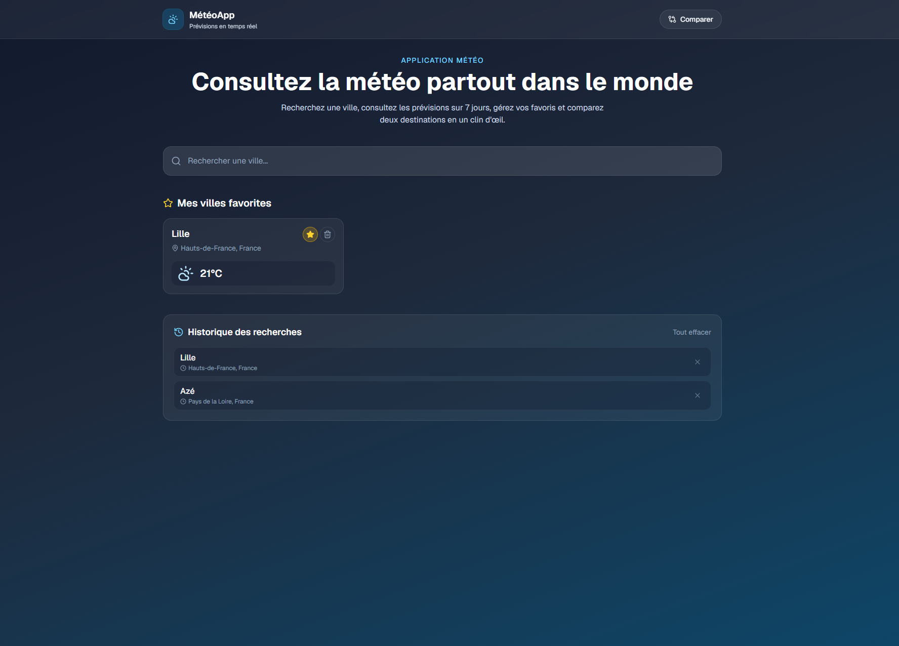
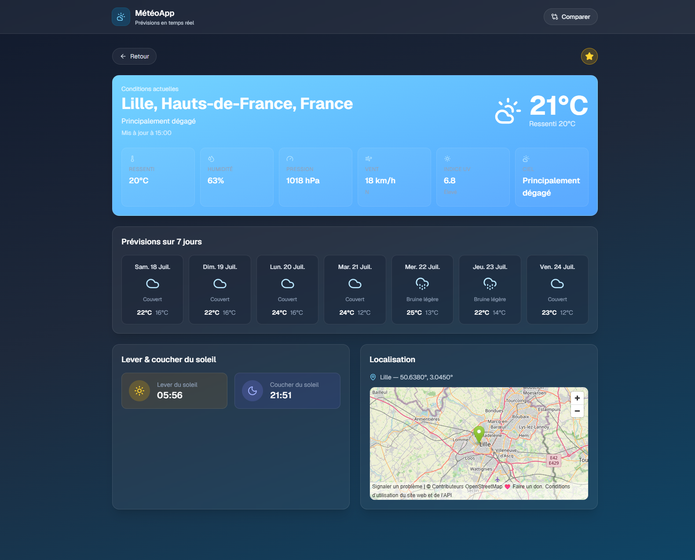
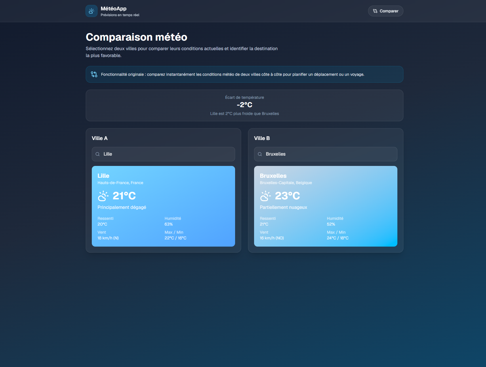

# Meteo App

Meteo App est une application météo construite avec Next.js. Elle permet de rechercher une ville, consulter la météo détaillée, suivre ses favoris, retrouver l'historique des recherches et comparer deux destinations.

## Fonctionnalités implémentées

- Recherche de villes via autocomplétion.
- Page de détail météo avec conditions actuelles, prévisions sur 7 jours, lever/coucher du soleil et carte.
- Gestion des villes favorites avec persistance locale.
- Historique des recherches avec ajout et suppression.
- Comparaison météo entre deux villes.

## Fonctionnalité originale

La fonctionnalité originale du projet est la comparaison météo entre deux villes. Elle apporte une vraie valeur ajoutée pour choisir entre deux destinations en affichant côte à côte la température, l'humidité, le vent et la tendance météo. Techniquement, l'écran de comparaison récupère d'abord les villes via l'API de géocodage, puis interroge Open-Meteo pour charger les données météo de chaque ville et afficher un résumé comparatif en temps réel.

## Technologies utilisées

- Next.js 16 avec App Router
- React 19
- TypeScript
- Tailwind CSS 4
- Lucide React
- API Open-Meteo pour le géocodage et la météo

## Architecture

- Les pages du dossier `src/app` sont principalement rendues en Server Components.
- Les interactions utilisateur sont gérées dans des Client Components, par exemple la recherche, les favoris, l'historique et la comparaison.
- Les appels aux services externes sont centralisés dans `src/lib/api`.

## Installation et lancement

```bash
git clone <url-du-depot>
cd meteo-app
npm install
npm run dev
```

Puis ouvrez [http://localhost:3000](http://localhost:3000).

## Variables d'environnement

Aucune variable d'environnement n'est requise pour le moment.

## Captures d'écran







La gestion des favoris est visible depuis la page d'accueil ci-dessus.
